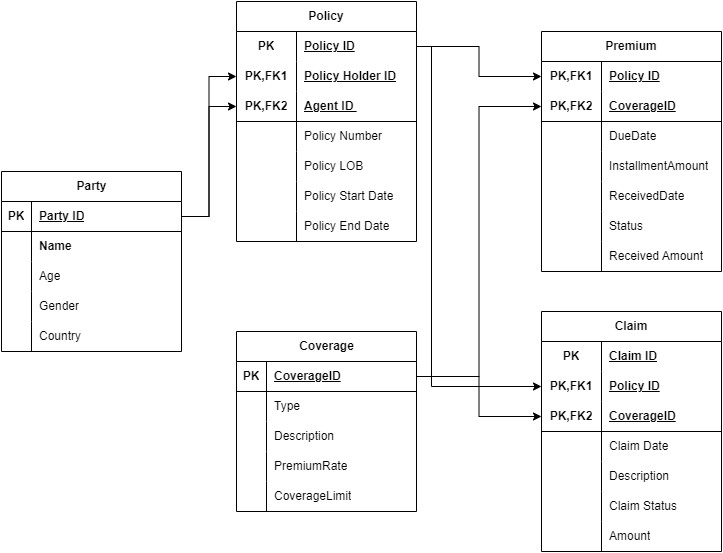

# SQL Case Study Insurance Domain

**The below image will be the ER diagram for the entire SQL Problem statement.**



## Party Table

**Description:**
The "Party" table contains information about party ie Policy Holder or Agent ,generaly the party table will hold person related data. Each column is described as follows:

- **PartID (PK):** Primary Key, an integer that uniquely identifies each party (individual or entity) in the table.
- **Name:** The name of the party.
- **Age:** The age of the party, representing their age in years.
- **Gender:** The gender of the party, indicating whether they are male, female, or another gender identity.
- **Country:** The country where the party is located or associated.

| PartID | Name         | Age | Gender | Country   |
|--------|--------------|-----|--------|-----------|
| 1      | John Doe     | 30  | Male   | USA       |
| 2      | Jane Smith   | 25  | Female | Canada    |
| 3      | Alex Johnson | 40  | Male   | UK        |
| 4      | Maria Garcia | 28  | Female | Spain     |
| 5      | Kim Lee      | 35  | Female | South Korea |

## Policy Table

| PolicyID | PolicyNumber | PolicyHolderID | AgentID | PolicyLOB | PolicyStartDate | PolicyEndDate |
|----------|--------------|-----------------|---------|------------|------------------|---------------|
| 1        | POL001       | 1               | 2       | Life       | 2024-01-01       | 2025-01-01    |
| 2        | POL002       | 3               | 4       | Health     | 2024-02-15       | 2025-02-15    |
| 3        | POL003       | 2               | 1       | Auto       | 2024-03-10       | 2025-03-10    |
| 4        | POL004       | 4               | 3       | Property   | 2024-04-05       | 2025-04-05    |
| 5        | POL005       | 1               | 2       | Life       | 2024-05-20       | 2025-05-20    |

**Description:**
The "Policy" table contains information about insurance policies. Each column is described as follows:

- **PolicyID:** Unique identifier for each policy.
- **PolicyNumber:** A unique identifier for each policy.
- **PolicyHolderID:** Foreign Key referencing the Party table's PartyID, representing the policyholder.
- **AgentID:** Foreign Key referencing the Party table's PartyID, representing the agent associated with the policy.
- **PolicyLOB:** Line of Business, indicating the type of insurance coverage (e.g., life, health).
- **PolicyStartDate:** The start date of the policy coverage.
- **PolicyEndDate:** The end date of the policy coverage.

## Coverage Table

| CoverageID | Type   | Description                  | PremiumRate | CoverageLimit |
|------------|--------|------------------------------|-------------|---------------|
| 1          | Life   | Life insurance coverage      | $35      | $1,000,000    |
| 2          | Health | Health insurance coverage    | $45      | $500,000      |
| 3          | Auto   | Auto insurance coverage      | $40      | $100,000      |
| 4          | Home   | Home insurance coverage      | $38      | $250,000      |
| 5          | Travel | Travel insurance coverage    | $50      | $50,000       |

**Description:**
The "Coverage" table contains information about different types of insurance coverage. Each column is described as follows:

- **CoverageID:** Unique identifier for each type of coverage.
- **Type:** The type of coverage provided by the policy (e.g., life, health, auto).
- **Description:** A brief description of the coverage and its features.
- **PremiumRate:** The rate at which the premium is calculated for this type of coverage (in dollars).
- **CoverageLimit:** The maximum amount that the policy will cover for a specific type of loss or event.

## Premium Table

| PremiumID | PolicyID | CoverageID | DueDate    | InstallmentAmount | ReceivedAmount | ReceivedDate |
|-----------|----------|------------|------------|-------------------|-----------------|--------------|
| 1         | 1        | 1          | 2024-02-01 | $100              | $100            | 2023-01-25   |
| 2         | 1        | 2          | 2024-03-01 | $150              | $150            | 2023-02-28   |
| 3         | 2        | 3          | 2024-02-15 | $120              | $120            | 2023-02-10   |
| 4         | 3        | 4          | 2024-03-10 | $200              | $200            | 2024-03-05   |
| 5         | 4        | 5          | 2023-04-01 | $80               | null            | null         |
| 6         | 2        | 2          | 2023-04-01 | $180              | null            | null         |
| 7         | 3        | 3          | 2024-04-15 | $150              | null            | null         |

**Description:**
The "Premium" table contains information about premium payments for insurance policies. Each row represents a premium payment.

- **PremiumID:** Unique identifier for each premium payment.
- **PolicyID:** Foreign Key referencing the "Policy" table's PolicyID.
- **CoverageID:** Foreign Key referencing the "Coverage" table's CoverageID.
- **DueDate:** The date by which the premium installment is due.
- **InstallmentAmount:** The amount of the premium installment.
- **ReceivedAmount:** The amount of the premium installment that has been received.
- **ReceivedDate:** The date on which the premium installment is received.
- **Status:** The status of the premium installment (e.g., Paid, Unpaid).

## Claim Table

| ClaimID | PolicyID | CoverageID | ClaimDate  | Description               | ClaimStatus | Amount   |
|---------|----------|------------|------------|---------------------------|-------------|----------|
| 1       | 1        | 1          | 2024-02-15 | Car accident              | Pending     | $5,000   |
| 2       | 2        | 2          | 2024-03-10 | Hospitalization           | Approved    | $10,000  |
| 3       | 3        | 3          | 2024-04-05 | Property damage           | Denied      | $2,000   |
| 4       | 4        | 4          | 2024-05-01 | Travel delay              | Pending     | $500     |
| 5       | 1        | 2          | 2024-06-15 | Medical expenses          | Approved    | $8,000   |

**Description:**
The "Claim" table contains information about insurance claims. Each column is described as follows:

- **ClaimID:** Unique identifier for each claim.
- **PolicyID:** Foreign Key referencing the "Policy" table's PolicyID.
- **CoverageID:** Foreign Key referencing the "Coverage" table's CoverageID.
- **ClaimDate:** The date when the claim is filed or processed.
- **Description:** Additional information or details about the claim.
- **ClaimStatus:** The status of the claim (e.g., Pending, Approved, Denied).
- **Amount:** The amount associated with the claim.

---

## Q&A

**1.find the number of active policies available in the insurance database.**

```text
Hint: To find expired policy use Policy End Date
```

Input:

| PolicyID | PolicyNumber | PolicyHolderID | AgentID | PolicyLOB | PolicyStartDate | PolicyEndDate |
|----------|--------------|-----------------|---------|------------|------------------|---------------|
| 1        | POL001       | 1               | 2       | Life       | 2022-01-01       | 2023-01-01    |
| 2        | POL002       | 3               | 4       | Health     | 2022-02-15       | 2023-02-15    |
| 3        | POL003       | 2               | 1       | Auto       | 2022-03-10       | 2023-03-10    |
| 4        | POL004       | 4               | 3       | Property   | 2024-04-05       | 2025-04-05    |
| 5        | POL005       | 1               | 2       | Life       | 2023-05-20       | 2024-05-20    |

Output:
1

---

**2. Find the Agent who  created atleast 2 policy.**

Input:

| AgentID | Name         | Age | Gender | Country   |
|--------|--------------|-----|--------|-----------|
| 1      | John Doe     | 30  | Male   | USA       |
| 2      | Jane Smith   | 25  | Female | Canada    |

| PolicyID | PolicyNumber | PolicyHolderID | AgentID | PolicyLOB | PolicyStartDate | PolicyEndDate |
|----------|--------------|-----------------|---------|------------|------------------|---------------|
| 1        | POL001       | 1               | 2       | Life       | 01-01-2024       | 01-01-2025    |
| 2        | POL002       | 3               | 4       | Health     | 15-02-2024       | 15-02-2025    |
| 3        | POL003       | 2               | 1       | Auto       | 10-03-2024       | 10-03-2025    |
| 4        | POL004       | 4               | 3       | Property   | 05-04-2024       | 05-04-2025    |
| 5        | POL005       | 1               | 2       | Life       | 20-05-2024       | 20-05-2025    |

Output:
| Agent ID | Agent Name | No Of Policy |
|----------|------------|--------------|
| 2      | Jane Smith | 2           |

---

 **3.Find the number of Adult Policy Holders in Each country  with number of policy.**

 ```text
 Tip: Check Weather a Policy holder is adult or not using the age in Policy Holder Table
 Adult Age >= 18
 ```

 Input:
 PolicyHolderID Table

 | PolicyHolderID | Name         | Age | Gender | Country   |
|--------|--------------|-----|--------|-----------|
| 1      | John Doe     | 10  | Male   | USA       |
| 2      | Jane Smith   | 25  | Female | Canada    |
| 3      | Alex Johnson | 15  | Male   | UK        |
| 4      | Maria Garcia | 28  | Female | USA     |
| 5      | Kim Lee      | 12  | Female | South Korea |

Policy Table :

| PolicyID | PolicyNumber | PolicyHolderID | AgentID | PolicyLOB | PolicyStartDate | PolicyEndDate |
|----------|--------------|-----------------|---------|------------|------------------|---------------|
| 1        | POL001       | 1               | 2       | Life       | 2024-01-01       | 2025-01-01    |
| 2        | POL002       | 3               | 4       | Health     | 2024-02-15       | 2025-02-15    |
| 3        | POL003       | 2               | 1       | Auto       | 2024-03-10       | 2025-03-10    |
| 4        | POL004       | 4               | 3       | Property   | 2024-04-05       | 2025-04-05    |
| 5        | POL005       | 1               | 2       | Life       | 2024-05-20       | 2025-05-20    |

Output:

| Country      | No Of Adult Policy Holders |
|--------------|----------------------------|
| USA          | 2                       |
| Canada       | 1                       |
| UK| 1                       |
| South Korea    | 1                       |

---

**4.Find the Premium Amount generated by each Agent and find the top 3 agent based on premium generated.**

Input:

| Agent ID | Agent Name      | Total Premium |
|----------|-----------------|---------------|
| 1        | John Doe        | $10,000       |
| 2        | Jane Smith      | $15,000       |
| 2        | Jane Smith      | $15,500       |
| 2        | Jane Smith      | $14,800       |
| 3        | Mark Johnson    | $8,200        |
| 4        | Sarah Brown     | $11,300       |
| 5        | Robert Davis    | $9,800        |
| 6        | Emily White     | $11,750       |
| 6        | Emily White     | $13,200       |
| 6        | Emily White     | $12,500       |
| 7        | Michael Lee     | $14,600       |
| 8        | Laura Miller    | $13,200       |
| 9        | Kevin Wilson    | $7,500        |
| 10       | Lisa Thompson   | $16,000       |

Output:
| Rank | Agent Name      | Total Premium |
|------|-----------------|---------------|
| 1    | Lisa Thompson   | $16,000       |
| 2    | Jane Smith      | $15,500       |
| 3    | Jane Smith      | $15,000       |

---

**5.Find the top Coverage Type taken by the Policy Holders.**

Input:

Coverage:
| CoverageID | Type   | Description                  | PremiumRate | CoverageLimit |
|------------|--------|------------------------------|-------------|---------------|
| 1          | Life   | Life insurance coverage      | $35      | $1,000,000    |
| 2          | Health | Health insurance coverage    | $45      | $500,000      |
| 3          | Auto   | Auto insurance coverage      | $40      | $100,000      |
| 4          | Home   | Home insurance coverage      | $38      | $250,000      |
| 5          | Travel | Travel insurance coverage    | $50      | $50,000       |

Premium:
| policyId | coverageId |
|----------|------------|
| 1        | 1          |
| 1        | 3          |
| 2        | 4          |
| 3        | 1          |
| 4        | 3          |
| 2        | 1          |
| 3        | 4          |
| 1        | 1          |
| 4        | 3          |
| 2        | 4          |
| 3        | 1          |
| 1        | 3          |
| 2        | 1          |
| 3        | 4          |
| 4        | 1          |
| 2        | 3          |
| 3        | 4          |
| 1        | 1          |
| 4        | 3          |
| 2        | 4          |

Output:

| CoverageID | CoverageType           | PolicyCount |
|------------|------------------------|-------------|
| 1          | Life                   | 5           |

---

**6.Find the pending premium which has to be paid by each Policy Holder and display the Last due date in Premium date as Last Date to Pay.**

Input:

| PremiumID | PolicyID | CoverageID | PolicyHolderName | DueDate    | InstallmentAmount | ReceivedAmount | ReceivedDate |
|-----------|----------|------------|------------------|------------|-------------------|-----------------|--------------|
| 1         | 1        | 1          | John Doe         | 2024-02-01 | $100              | $100            | 2023-01-25   |
| 2         | 1        | 2          | John Doe         | 2024-03-01 | $150              | $150            | 2023-02-28   |
| 3         | 2        | 3          | Jane Smith       | 2024-02-15 | $120              | $120            | 2023-02-10   |
| 4         | 3        | 4          | Mark Johnson     | 2024-03-10 | $200              | $200            | 2024-03-05   |
| 5         | 4        | 5          | Sarah Brown      | 2023-04-01 | $80               | null            | null         |
| 6         | 2        | 2          | Jane Smith       | 2023-04-01 | $180              | null            | null         |
| 7         | 3        | 3          | Mark Johnson     | 2024-04-15 | $150              | null            | null         |
| 8         | 4        | 5          | Sarah Brown      | 2023-05-01 | $80               | null            | null         |
| 9         | 2        | 2          | Jane Smith       | 2023-05-01 | $180              | null            | null         |

```text
Hints: 
1.find the difference of InstallmentAmount and ReceivedAmount.
2.If the Due is less than the current date and the ReceivedAmount is less than the InstallmentAmount, it is considered as Pending Premium Amount.
3.After finding the Pending Premium, take maximum of unpaid premium date as Last date to pay.       
```

Output:
| PremiumID | PolicyID | CoverageID | PolicyHolderName | DueDate    | InstallmentAmount | ReceivedAmount | ReceivedDate |
|-----------|----------|------------|------------------|------------|-------------------|-----------------|--------------|
| 8         | 4        | 5          | Sarah Brown      | 2023-05-01 | $160               | null            | null         |
| 9         | 2        | 2          | Jane Smith       | 2023-05-01 | $360              | null            | null         |

---

**7.Compare the premium which is generated by Agent year over year.**

Input:
| Agent ID | Received Date | Amount |
|----------|---------------|--------|
| 1        | 2023-01-15    | $100   |
| 1        | 2023-02-28    | $150   |
| 1        | 2023-03-10    | $120   |
| 1        | 2023-04-05    | $200   |
| 1        | 2023-05-01    | $80    |
| 1        | 2023-06-15    | $180   |
| 3        | 2023-01-20    | $90    |
| 3        | 2023-03-05    | $120   |
| 3        | 2023-04-10    | $150   |
| 3        | 2023-05-15    | $200   |
| 3        | 2023-06-01    | $100   |
| 3        | 2023-07-20    | $130   |
| 4        | 2023-01-25    | $110   |
| 4        | 2023-03-10    | $160   |
| 4        | 2023-04-15    | $140   |
| 4        | 2023-05-20    | $180   |
| 4        | 2023-06-05    | $120   |
| 4        | 2023-07-15    | $200   |
| 1        | 2024-01-15    | $100   |
| 1        | 2024-02-28    | $150   |
| 1        | 2024-03-10    | $120   |
| 1        | 2024-04-05    | $200   |
| 1        | 2024-05-01    | $80    |
| 1        | 2024-06-15    | $180   |
| 3        | 2024-01-20    | $90    |
| 3        | 2024-03-05    | $120   |
| 3        | 2024-04-10    | $150   |
| 3        | 2024-05-15    | $200   |
| 3        | 2024-06-01    | $100   |
| 3        | 2024-07-20    | $130   |
| 4        | 2024-01-25    | $110   |
| 4        | 2024-03-10    | $160   |
| 4        | 2024-04-15    | $140   |
| 4        | 2024-05-20    | $180   |
| 4        | 2024-06-05    | $120   |
| 4        | 2024-07-15    | $200   |

Sample Output:
| Agent ID | Year(received date) | Current Year Amount | Previous Year Amount | Percentage Difference |
|----------|----------------------|----------------------|-----------------------|------------------------|
| 1        | 2023               | $950               | $0                    | -                      |
| 1        | 2024               | $630               | $950                  | -33.68%                |
| 3        | 2023               | $710               | $0                    | -                      |
| 3        | 2024               | $660               | $710                  | -7.04%                 |
| 4        | 2023               | $890               | $0                    | -                      |
| 4        | 2024               | $940               | $890                  | 5.62%                  |

---

**8.Find the running Premium generated by a Agent over the series of month.**

```text
Tip: Sum of ReceivedAmount (Use Window function, running total) 
```

Input:
| Agent ID | Received Date | Amount |
|----------|---------------|--------|
| 1        | 2023-01-15    | $100   |
| 1        | 2023-02-28    | $150   |
| 1        | 2023-03-10    | $120   |
| 1        | 2023-04-05    | $200   |
| 1        | 2023-05-01    | $80    |
| 1        | 2023-06-15    | $180   |
| 3        | 2023-01-20    | $90    |
| 3        | 2023-03-05    | $120   |
| 3        | 2023-04-10    | $150   |
| 3        | 2023-05-15    | $200   |
| 3        | 2023-06-01    | $100   |
| 3        | 2023-07-20    | $130   |
| 4        | 2023-01-25    | $110   |
| 4        | 2023-03-10    | $160   |
| 4        | 2023-04-15    | $140   |
| 4        | 2023-05-20    | $180   |
| 4        | 2023-06-05    | $120   |
| 4        | 2023-07-15    | $200   |
| 1        | 2024-01-15    | $100   |
| 1        | 2024-02-28    | $150   |
| 1        | 2024-03-10    | $120   |
| 1        | 2024-04-05    | $200   |
| 1        | 2024-05-01    | $80    |
| 1        | 2024-06-15    | $180   |
| 3        | 2024-01-20    | $90    |
| 3        | 2024-03-05    | $120   |
| 3        | 2024-04-10    | $150   |
| 3        | 2024-05-15    | $200   |
| 3        | 2024-06-01    | $100   |
| 3        | 2024-07-20    | $130   |
| 4        | 2024-01-25    | $110   |
| 4        | 2024-03-10    | $160   |
| 4        | 2024-04-15    | $140   |
| 4        | 2024-05-20    | $180   |
| 4        | 2024-06-05    | $120   |
| 4        | 2024-07-15    | $200   |

Output:
| Agent ID | Received Date | Amount | Year | Running Total |
|----------|---------------|--------|------|---------------|
| 1        | 2023-01-15    | $100   | 2023 | $100          |
| 1        | 2023-02-28    | $150   | 2023 | $250          |
| 1        | 2023-03-10    | $120   | 2023 | $370          |
| 1        | 2023-04-05    | $200   | 2023 | $570          |
| 1        | 2023-05-01    | $80    | 2023 | $650          |
| 1        | 2023-06-15    | $180   | 2023 | $830          |
| 1        | 2024-01-15    | $100   | 2024 | $930          |
| 1        | 2024-02-28    | $150   | 2024 | $1,080        |
| 1        | 2024-03-10    | $120   | 2024 | $1,200        |
| 1        | 2024-04-05    | $200   | 2024 | $1,400        |
| 1        | 2024-05-01    | $80    | 2024 | $1,480        |
| 1        | 2024-06-15    | $180   | 2024 | $1,660        |
| 3        | 2023-01-20    | $90    | 2023 | $90           |
| 3        | 2023-03-05    | $120   | 2023 | $210          |
| 3        | 2023-04-10    | $150   | 2023 | $360          |
| 3        | 2023-05-15    | $200   | 2023 | $560          |
| 3        | 2023-06-01    | $100   | 2023 | $660          |
| 3        | 2023-07-20    | $130   | 2023 | $790          |
| 3        | 2024-01-20    | $90    | 2024 | $90           |
| 3        | 2024-03-05    | $120   | 2024 | $210          |
| 3        | 2024-04-10    | $150   | 2024 | $360          |
| 3        | 2024-05-15    | $200   | 2024 | $560          |
| 3        | 2024-06-01    | $100   | 2024 | $660          |
| 3        | 2024-07-20    | $130   | 2024 | $790          |
| 4        | 2023-01-25    | $110   | 2023 | $110          |
| 4        | 2023-03-10    | $160   | 2023 | $270          |
| 4        | 2023-04-15    | $140   | 2023 | $410          |
| 4        | 2023-05-20    | $180   | 2023 | $590          |
| 4        | 2023-06-05    | $120   | 2023 | $710          |
| 4        | 2023-07-15    | $200   | 2023 | $910          |
| 4        | 2024-01-25    | $110   | 2024 | $1,020        |
| 4        | 2024-03-10    | $160   | 2024 | $1,180        |
| 4        | 2024-04-15    | $140   | 2024 | $1,320        |
| 4        | 2024-05-20    | $180   | 2024 | $1,500        |
| 4        | 2024-06-05    | $120   | 2024 | $1,620        |
| 4        | 2024-07-15    | $200   | 2024 | $1,820        |

---

**9. Create view CLM_VW with column called SettledAmount on top of claim table, using the provided logic.**

```text
1.Compare the Coverage Limit in coverage table and Claim Amount in the Claim table.
2.If the CoverageLimit is more than claim Amount in claim table then the SettledAmount will the Claim Amount.
3.If the CoverageLimit is less than claim Amount in claim table then the SettledAmount will the Coverage limit.

for reference review the output provided below.
```

Input:
Policy Table :
| PolicyID | PolicyNumber | PolicyHolderID | AgentID | PolicyLOB | PolicyStartDate | PolicyEndDate |
|----------|--------------|-----------------|---------|------------|------------------|---------------|
| 1        | POL001       | 1               | 2       | Life       | 2024-01-01       | 2025-01-01    |
| 2        | POL002       | 3               | 4       | Health     | 2024-02-15       | 2025-02-15    |
| 3        | POL003       | 2               | 1       | Auto       | 2024-03-10       | 2025-03-10    |
| 4        | POL004       | 4               | 3       | Property   | 2024-04-05       | 2025-04-05    |
| 5        | POL005       | 1               | 2       | Life       | 2024-05-20       | 2025-05-20    |
| 6        | POL005       | 1               | 2       | Life       | 2024-05-20       | 2025-05-20    |
---
Coverage
| CoverageID | Type   | Description                  | PremiumRate | CoverageLimit |
|------------|--------|------------------------------|-------------|---------------|
| 1          | Life   | Life insurance coverage      | $35      | $1,000,000    |
| 2          | Health | Health insurance coverage    | $45      | $3,000      |
| 3          | Auto   | Auto insurance coverage      | $40      | $2,000      |
| 4          | Home   | Home insurance coverage      | $38      | $250,000      |
| 5          | Travel | Travel insurance coverage    | $50      | $50,000       |
---
Claim:
| ClaimID | PolicyID | CoverageID | ClaimDate  | Description               | ClaimStatus | Amount   |
|---------|----------|------------|------------|---------------------------|-------------|----------|
| 1       | 1        | 1          | 2024-02-15 | Car accident              | Pending     | $5,000   |
| 2       | 2        | 2          | 2024-03-10 | Hospitalization           | Approved    | $1,000  |
| 3       | 3        | 3          | 2024-04-05 | Property damage           | Denied      | $2,000   |
| 4       | 4        | 4          | 2024-05-01 | Travel delay              | Pending     | $500     |
| 5       | 1        | 2          | 2024-06-15 | Medical expenses          | Approved    | $8,000   |

Sample Output:
| ClaimID | PolicyID | CoverageID | ClaimDate   | Description       | ClaimStatus | Amount  | CoverageLimit | SettledAmount |
|---------|----------|------------|-------------|-------------------|-------------|---------|---------------|---------------|
| 1       | 1        | 3          | 15-02-2024  | Car accident      | Pending     | $5,000  | $2,000        | $2,000        |
| 2       | 2        | 2          | 10-03-2024  | Hospitalization   | Approved    | $1,000  | $3,000        | $1,000        |

---

**10.The Insurance Company Plans to provide discount to Policy holders, who doesn't have any claim history, so list out the policy holders who haven't created any claim.**

```text
Hint: Find the Policy who doesn't have any claim created
```

Input:
Policy Holder:
| PolicyHolderID | Name         | Age | Gender | Country   |
|--------|--------------|-----|--------|-----------|
| 1      | John Doe     | 30  | Male   | USA       |
| 2      | Jane Smith   | 25  | Female | Canada    |
| 3      | Alex Johnson | 40  | Male   | UK        |
| 4      | Maria Garcia | 28  | Female | Spain     |
| 5      | Kim Lee      | 35  | Female | South Korea |
Policy:
| PolicyID | PolicyNumber | PolicyHolderID | AgentID | PolicyLOB | PolicyStartDate | PolicyEndDate |
|----------|--------------|-----------------|---------|------------|------------------|---------------|
| 1        | POL001       | 1               | 2       | Life       | 2024-01-01       | 2025-01-01    |
| 2        | POL002       | 2               | 4       | Health     | 2024-02-15       | 2025-02-15    |
| 3        | POL003       | 2               | 1       | Auto       | 2024-03-10       | 2025-03-10    |
| 4        | POL004       | 4               | 3       | Property   | 2024-04-05       | 2025-04-05    |
| 5        | POL005       | 3               | 2       | Life       | 2024-05-20       | 2025-05-20    |
Claim Table:
| ClaimID | PolicyID | CoverageID | ClaimDate  | Description               | ClaimStatus | Amount   |
|---------|----------|------------|------------|---------------------------|-------------|----------|
| 1       | 1        | 1          | 2024-02-15 | Car accident              | Pending     | $5,000   |
| 2       | 2        | 2          | 2024-03-10 | Hospitalization           | Approved    | $10,000  |
| 3       | 3        | 3          | 2024-04-05 | Property damage           | Denied      | $2,000   |
| 4       | 4        | 5          | 2024-05-01 | Travel delay              | Pending     | $500     |
| 5       | 1        | 2          | 2024-06-15 | Medical expenses          | Approved    | $8,000   |

Output:
| PolicyHolderID | Name         | Age | Gender | Country   |
|--------|--------------|-----|--------|-----------|
| 4      | Maria Garcia | 28  | Female | Spain     |

---

**11.Add a column(Use Stored Procedure) in Policy Table as Policy Status, it should have only three vlaues "Active", "Expired" and "Quote".**

```text
Condition: 
1.If the Policy Enddate is Less than Current date then "Expired". 
2.If the Policy Start Date is Less than the Current Date and Policy Enddate is greater than Current date then "Active". 
3.If the Policy Start Date is greater than the Current Date then "Quote".
```

Input:
| PolicyID | PolicyNumber | PolicyHolderID | AgentID | PolicyLOB | PolicyStartDate | PolicyEndDate |
|----------|--------------|-----------------|---------|------------|------------------|---------------|
| 1        | POL001       | 1               | 2       | Life       | 2022-01-01       | 2023-01-01    |
| 2        | POL002       | 3               | 4       | Health     | 2022-02-15       | 2023-02-15    |
| 3        | POL003       | 2               | 1       | Auto       | 2022-03-10       | 2023-03-10    |
| 4        | POL004       | 4               | 3       | Property   | 2024-04-05       | 2025-04-05    |
| 5        | POL005       | 1               | 2       | Life       | 2023-05-20       | 2024-05-20    |

Output:
| PolicyID | PolicyNumber | PolicyHolderID | AgentID | PolicyLOB | PolicyStartDate | PolicyEndDate | PolicyStatus |
|----------|--------------|-----------------|---------|------------|------------------|---------------|--------------|
| 1        | POL001       | 1               | 2       | Life       | 2022-01-01       | 2023-01-01    | Expired      |
| 2        | POL002       | 3               | 4       | Health     | 2022-02-15       | 2023-02-15    | Expired      |
| 3        | POL003       | 2               | 1       | Auto       | 2022-03-10       | 2023-03-10    | Expired      |
| 4        | POL004       | 4               | 3       | Property   | 2024-04-05       | 2025-04-05    | Quote        |
| 5        | POL005       | 1               | 2       | Life       | 2023-05-20       | 2024-05-20    | Active       |

---

**12.Find Total number of policies by a agent for every year, the result should be in below format.**

Input:
| PolicyId | Agent ID | PolicyStartDate | PolicyEndDate |
|----------|----------|------------------|---------------|
| 1        | 2        | 2022-01-01       | 2023-01-01    |
| 2        | 4        | 2022-02-15       | 2023-02-15    |
| 3        | 1        | 2022-03-10       | 2023-03-10    |
| 4        | 3        | 2022-04-05       | 2023-04-05    |
| 5        | 2        | 2022-05-20       | 2023-05-20    |
| 6        | 4        | 2022-06-15       | 2023-06-15    |
| 7        | 1        | 2022-07-01       | 2023-07-01    |
| 8        | 3        | 2022-08-15       | 2023-08-15    |
| 9        | 2        | 2022-09-10       | 2023-09-10    |
| 10       | 4        | 2022-10-05       | 2023-10-05    |
| 11       | 1        | 2022-11-20       | 2023-11-20    |
| 12       | 3        | 2022-12-15       | 2023-12-15    |
| 13       | 2        | 2023-01-01       | 2024-01-01    |
| 14       | 4        | 2023-02-15       | 2024-02-15    |
| 15       | 1        | 2023-03-10       | 2024-03-10    |
| 16       | 3        | 2023-04-05       | 2024-04-05    |
| 17       | 2        | 2023-05-20       | 2024-05-20    |
| 18       | 4        | 2023-06-15       | 2024-06-15    |
| 19       | 1        | 2023-07-01       | 2024-07-01    |
| 20       | 3        | 2023-08-15       | 2024-08-15    |
| 21       | 2        | 2023-09-10       | 2024-09-10    |
| 22       | 4        | 2023-10-05       | 2024-10-05    |
| 23       | 1        | 2023-11-20       | 2024-11-20    |
| 24       | 3        | 2023-12-15       | 2024-12-15    |
| 25       | 2        | 2024-01-01       | 2025-01-01    |
| 26       | 4        | 2024-02-15       | 2025-02-15    |
| 27       | 1        | 2024-03-10       | 2025-03-10    |
| 28       | 3        | 2024-04-05       | 2025-04-05    |
| 29       | 2        | 2024-05-20       | 2025-05-20    |
| 30       | 4        | 2024-06-15       | 2025-06-15    |

Output:
| Agent ID | 2022 | 2023 | 2024 | 2025 |
|----------|------|------|------|------|
| 1        | 1    | 1    | 1    | 1    |
| 2        | 1    | 2    | 2    | 1    |
| 3        | 1    | 2    | 2    | 1    |
| 4        | 1    | 2    | 2    | 1    |
